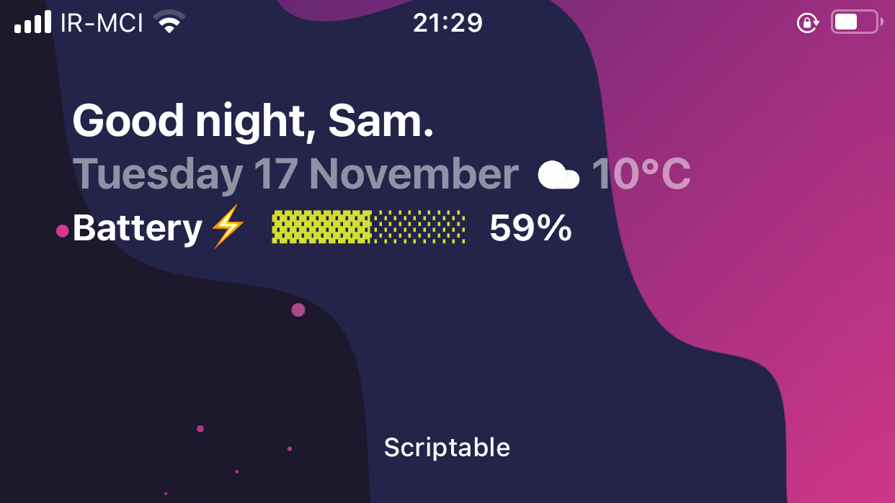

# Home-Intro-Widget-V2

    

A stylish transparent Intro widget with ability of both medium and large size for your homescreen. It has localization for any language.
Check out screenshot for more info.

Version 2 has new battery and new calender type.

Guideance: Put your API and City Code from openweathermap.org, also your local/country code.

Workable widget Size: Large, Medium.

